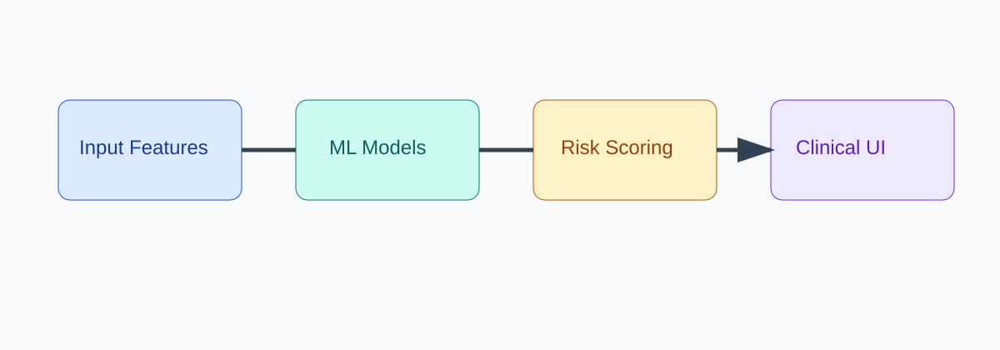

# 🩺 AI Health Assistant — Multi-Disease Risk Screening Platform


A production-grade Data Science + AI portfolio project that demonstrates how to operationalize machine learning models into a user-friendly web application.

[](https://www.python.org/)
[](https://streamlit.io/)
[](https://scikit-learn.org/)

## 🚀 Live Application
- **Direct app link:** Add your Render production URL here after deployment (example: `https://<your-service>.onrender.com`).

> Previous link issue root cause: the README contained an unverified guessed URL. In addition, deployment startup was missing `PYTHONPATH=src`, which is required after refactoring to the `src/` package layout.

## Why this project stands out
- **Business-facing framing:** clear value proposition, risk-screening workflows, and recruiter-ready storytelling.
- **End-to-end DS lifecycle:** datasets, model artifacts, packaged inference logic, and deployment configs.
- **Production-minded structure:** modular Python package, baseline tests, environment configuration, and deployment assets.
- **LinkedIn-ready presentation:** visual documentation and polished highlights for your Projects section.

## Product Workflow


## Live capabilities
This Streamlit app provides interactive risk screening for:
1. Diabetes
2. Heart Disease
3. Parkinson’s Disease
4. Liver Disease

> ⚠️ **Disclaimer:** This tool is for educational/demo use only and is not a substitute for professional medical diagnosis.

---

## Project Architecture

```text
Disease_Predictor/
├── app.py                          # Streamlit entrypoint
├── src/health_assistant/
│   ├── config.py                   # app-level constants and paths
│   ├── inference.py                # model loading + prediction helpers
│   └── ui.py                       # Streamlit interface logic + validation
├── dataset/                        # raw training datasets
├── saved_models/                   # serialized trained models
├── tests/                          # baseline unit tests
├── docs/images/                    # recruiter-friendly visual assets
├── .streamlit/config.toml          # Streamlit theme/server settings
├── .github/workflows/              # CI/CD workflow(s)
├── colab_files_to_train_models/    # original training notebooks/scripts
├── requirements.txt
└── README.md
```

---

## Quickstart

### 1) Clone & install
```bash
git clone <your-repo-url>
cd Disease_Predictor
python -m venv .venv
source .venv/bin/activate  # Windows: .venv\Scripts\activate
pip install -r requirements.txt
```

### 2) Run locally
```bash
streamlit run app.py
```

### 3) Run tests
```bash
pytest -q
```

---

## Recruiter-Focused Highlights
- Built a **multi-model risk screening platform** with modular inference architecture.
- Designed a **clean analytics UX** for non-technical users with robust validation.
- Structured the repository like a **real-world production-grade DS project**.
- Added deployment-ready files (Docker + Render) and a polished documentation experience.

## Copy/Paste LinkedIn Project Description
**AI Health Assistant (Multi-Disease Risk Screening Platform)**  
Built and deployed a production-style ML application for multi-disease risk screening (Diabetes, Heart Disease, Parkinson’s, Liver Disease). Refactored monolithic code into modular architecture (`config`, `inference`, `ui`), added input validation and tests, and packaged the project with deployment + documentation assets to make it recruiter-ready.

## Tech Stack
- Python, Scikit-learn, Pandas, NumPy
- Streamlit
- Pytest
- Docker + Render

## Roadmap
- Add explainability layer (SHAP) for model transparency.
- Add model metrics dashboard (ROC-AUC, confusion matrix, drift checks).
- Add API layer (FastAPI) for service-oriented architecture.
